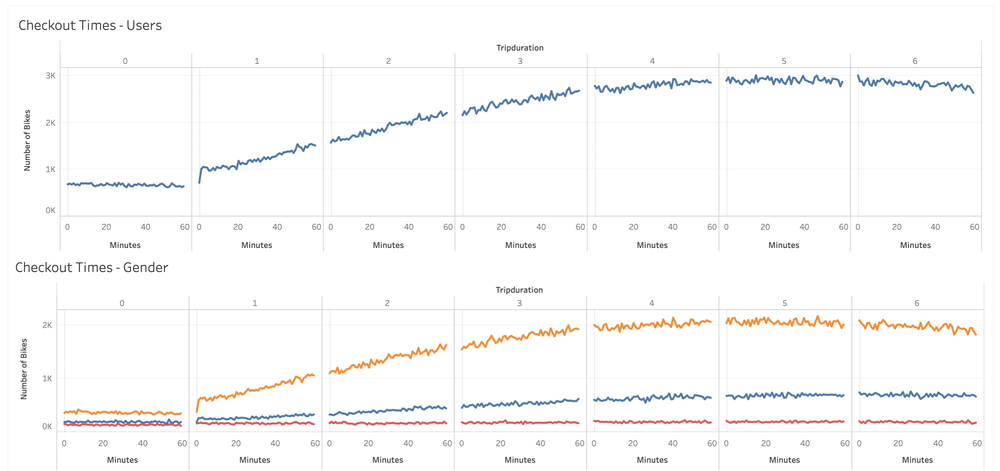
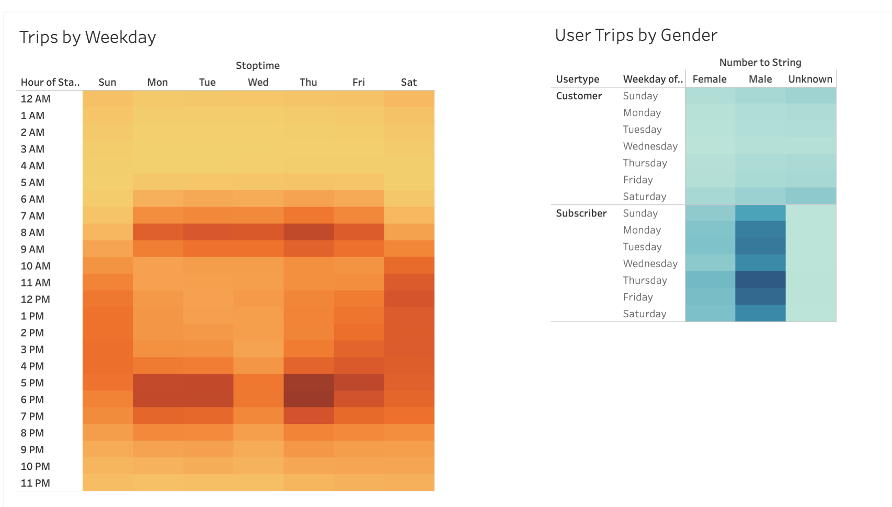
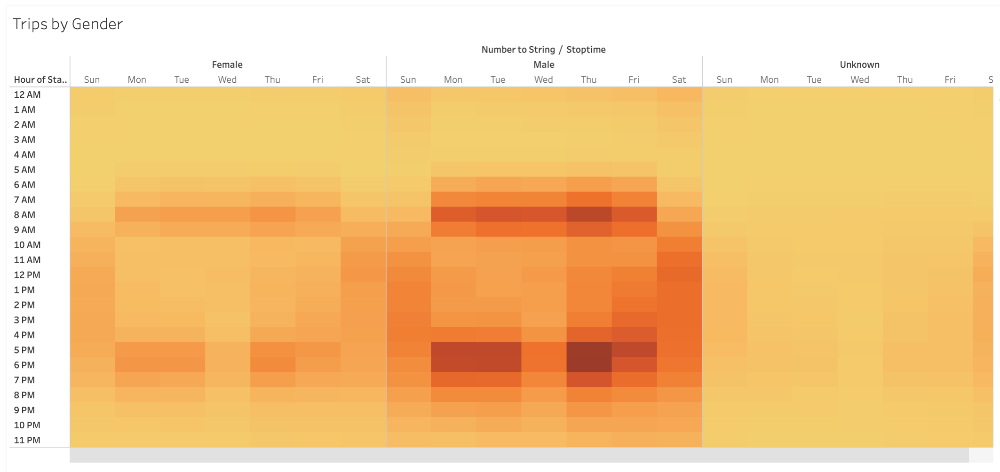
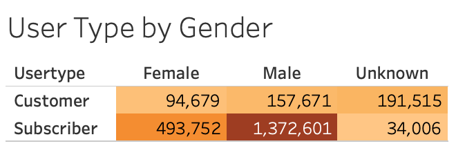
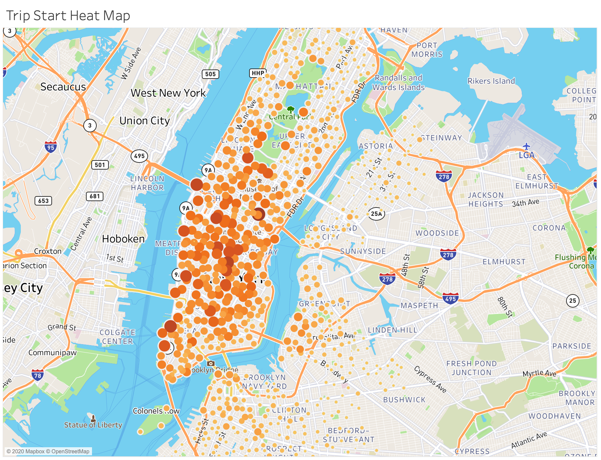

# NYC Citi Bike Sharing

## Results

### Checkout Times

Looking at the checkout times we can clearly see that the checkout times start to peak during the hours of 4 to 6, which indicates that users checkout the bike for the day first thing in the morning.  Due to the earlyness of this checkout time we can assume that the bikes are being largely used for transportation for the entire day, beginning with work.

**The below link takes you to the interactive dashboard**

[Checkout Times Dasboard](https://public.tableau.com/profile/teale.foster#!/vizhome/CheckoutTimes-Dashboard/CheckoutTimes-Dashboard)

**Snippet of the interactive dashboard**

### Trips by Weekday

In observing trips by weekday, we can see a clear increase in ridership in the afternoon hours indicating that users likely use the bikes for both commuting in the morning and afternoon when work lets out.  Based on the density of the colors we can also assume that ridership increases in the afternoon vs the morning.

Additionaly on this dashboard we can see the type of user by weekday and the gender.  Clearly the majority of rides take place with subscribed users and men are the primary users all days of the week.

**The below link takes you to the interactive dashboard**

[Trips by Weekday](https://public.tableau.com/profile/teale.foster#!/vizhome/TripsbyWeekday-Dashboard/TripsbyWeekday-Dashboard)

### Trips by Gender

Wehn looking at the trips by gender by weekday we the picture becomes clearer that the predominant users are men, again the pattern of checkouts during the early am and the evening remain consistent.  There is a strange outlier indicating a dip on Wednesday evenings.  We would need additional information to understand the drop in ridership during this time. 

**The below link takes you to the interactive dashboard**

[Trips by Gender](https://public.tableau.com/profile/teale.foster#!/vizhome/TripsbyWeekdaybyGender-Sheet/TripsbyGender)

### User Type by Gender

The user type by gender shows us an interesting observation.  There is a large number of non-subscriber users under the unknown gender, which could indicate that a large number of users opt to not complete their profile.

### Trip Start Heatmap

In the below heatmap we can see that the majority of trips begin in the center of the city with a wide dispursement of trips starting in Brooklyn and Green Point.

### NYC Citi Bike Tableau Story

[NYC Citi Bike Tableau Story](https://public.tableau.com/profile/teale.foster#!/vizhome/NYC_Citi_Bikeshare/NYBikeShare-Story)